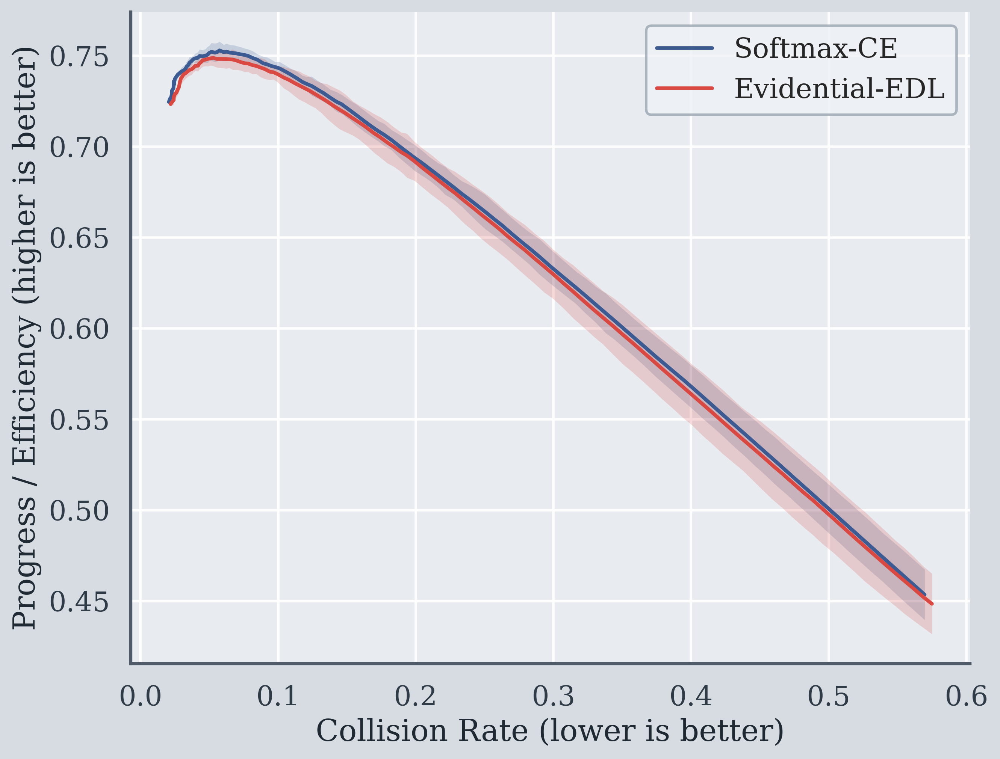
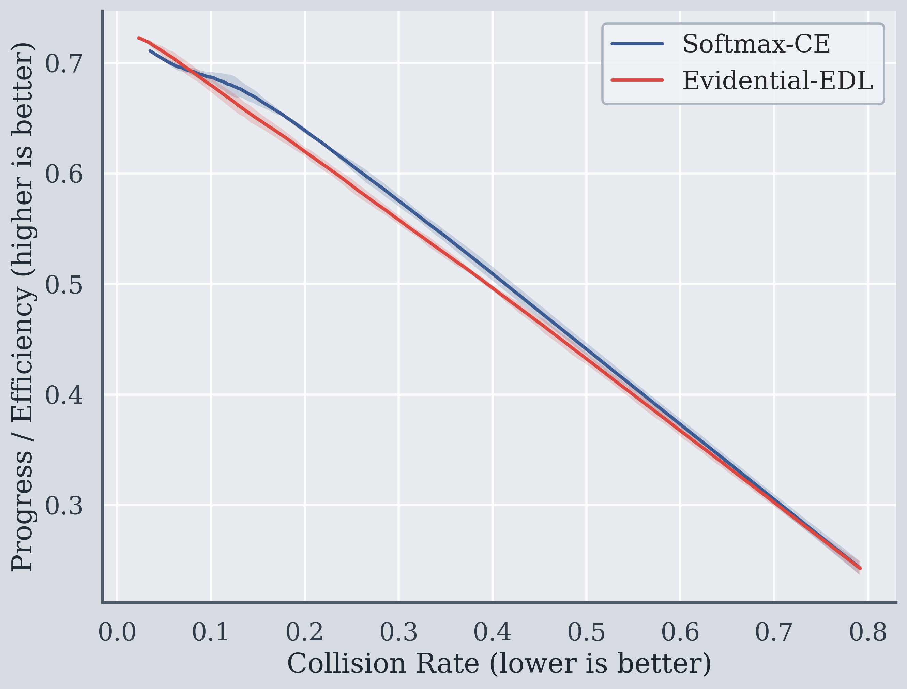
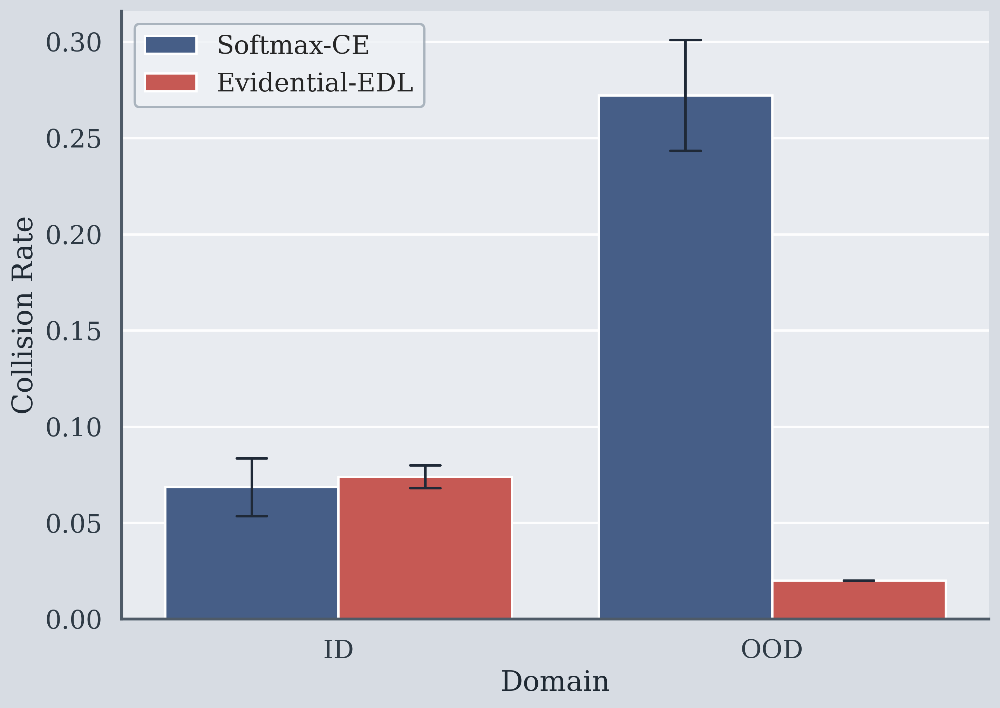
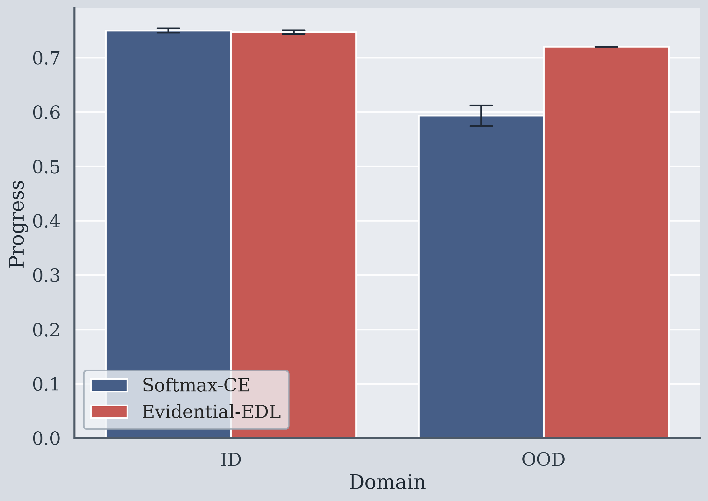

# Evidential 可行性

## 1. 完整目标

这个 demo 不追求复杂场景还原（暂不接 NavSim），只做“可行性验证 + 数据说话”。

核心验证目标有 5 条：

1. **Evidential 信号是否有信息量**  
看不确定性是否真的能反映风险，而不是随机噪声。

2. **OOD 可分性是否提升**  
看模型是否能把分布外样本识别为“更不确定”。

3. **策略层是否有收益**  
把不确定性信号接入门控后，是否能降低 collision。

4. **安全-效率 tradeoff 是否更优**  
安全提升时，效率（progress）是否保持在可接受范围。

5. **是否具备下一阶段价值**  
如果上述 1~4 成立，才值得进入更复杂系统（ NavSim / RL 微调）。

> 先证明“信号可用 + 门控有收益”，再谈大系统接入。

---

## 2. 问题设置（简化但有工程含义）

每个样本对应一个驾驶场景特征 `x`，策略要在两种动作中选一个：

1. `Aggressive`（效率高，但不安全时代价大）
2. `Conservative`（效率低一些，但更稳）

标签 `y_safe` 表示“在该场景下，Aggressive 是否安全”。

- 若选择 Aggressive 且 `y_safe=1`：高 progress，低 collision。  
- 若选择 Aggressive 且 `y_safe=0`：collision 高、progress 很低。  
- Conservative：collision 低但 progress 保守。

“规划里激进/保守权衡”的抽象。

---

## 3. 比较方法

1. `Softmax-CE`：标准分类器 + 风险分数门控。  
2. `Evidential-EDL`：evidence/Dirichlet 输出 + 不确定性门控。  

二者都用同样的验证集安全预算来选阈值（公平对比）。

---

## 4. 关键指标

### 4.1 信号质量

1. `ECE(ID)`：校准误差（越小越好）  
2. `NLL(ID)`：概率质量（越小越好）  
3. `Brier(ID)`：概率拟合误差（越小越好）  
4. `Unsafe-AUROC`：识别“危险样本”能力（越大越好）  
5. `OOD-AUROC`：区分 ID/OOD 能力（越大越好）

### 4.2 策略结果

1. `Collision`（越低越好）  
2. `Progress`（越高越好）  
3. `Aggressive Rate`（策略激进程度）  
4. `Safety Gain vs All-Aggressive`（相比全激进策略减少了多少风险）

---

## 5. 运行方式

在本目录执行：

```bash
python3 run_evidential_feasibility_demo.py --seeds 0 1 2 --epochs 90 --out-dir outputs
```

可调参数：

1. `--collision-budget`：验证集阈值搜索时的安全预算（默认 `0.085`）
2. `--epochs`：训练轮数
3. `--seeds`：多次随机种子

---

## 6. 输出文件

1. `outputs/REPORT.md`：最终结论摘要（先看这个）  
2. `outputs/signal_quality_summary.csv`：信号质量汇总  
3. `outputs/policy_outcome_summary.csv`：策略安全-效率汇总  
4. `outputs/frontier_points_per_seed.csv`：阈值扫描前沿点  
5. `outputs/figures/frontier_id|ood.(png/pdf)`：安全-效率曲线  
6. `outputs/figures/policy_collision_rate.(png/pdf)`：碰撞对比图  
7. `outputs/figures/policy_progress.(png/pdf)`：效率对比图

---

## 7. 是否“通过”

建议使用以下判据（可按你团队标准微调）：

1. Evidential 的 `OOD-AUROC` 高于 CE（信号层通过）
2. 在 OOD 上，Evidential 的 `Collision` 明显更低
3. 同时 `Progress` 不出现不可接受下降（或反而提升）
4. ID 上不要出现明显退化

若满足以上条件，就说明：

> “Evidential 信号 + 门控策略”在简化环境中具备可行性，值得进入下一阶段更真实系统验证。

---

## 8. 注意事项

1. 这是“可行性 demo”，不是最终性能上限。  
2. OOD 由合成分布构造，目的是验证机制而非复现真实道路统计。  
3. 后续进入 NavSim 时，需要替换为真实 closed-loop 指标与场景分桶。

---

## 9. 结果图（PNG）

ID Frontier：

OOD Frontier：

Policy Collision Rate：

Policy Progress：

