# EDL 训练对比

## 1. 概述

核心脚本：
- `edl_routeA_demo.py`

这个脚本会在同一套数据上训练并对比三种方法：
1. `Softmax-CE`（标准交叉熵）
2. `Softmax-LabelSmoothing`
3. `RouteA-EDL`（证据网络，MSE + 方差项 + 退火 KL 正则）

并输出统一指标：
- ID 分类：`Accuracy`, `NLL`, `Brier`, `ECE`
- OOD 检测：`OOD-AUROC`

---

## 2. 训练与评估设置

1. 数据：二维多类高斯数据（4 类）
2. 训练集：小样本 + 标签噪声（20%）
3. OOD：以“中心模糊区”样本为主，叠加一部分远离环状样本
4. 模型：同结构 MLP（2x64 隐层）
5. 公平对比：同优化器、同 epoch、同 batch、同数据划分

EDL 预测：
- 网络输出 evidence，构造 `alpha = softplus(logits) + 1`
- 预测概率使用 `p_mean = alpha / sum(alpha)`
- OOD 分数使用 `predictive_entropy + K/alpha0`

---

## 3. 问题定义

一个“分类 + 不确定性 + OOD 检测”的综合对比，不只看分类准确率。

1. `ID 分类任务`：  
在 4 类二维数据上做普通分类（样本来自已知分布）。

2. `校准任务`：  
不只看“分对没分对”，还看“模型给出的概率是否靠谱”。  
例如：模型说 90% 置信度的样本，真实是否大约 90% 会分对。

3. `OOD 检测任务`：  
给模型分布外样本（这里是中心模糊区域 + 远离环状区域），看它能否把这些“非训练分布样本”识别为不确定。

所以，这个 demo 比较的是三种训练方法在以下三件事上的综合能力：
1. 分类是否准。  
2. 概率是否可信。  
3. 遇到异常样本是否能谨慎。

---

## 4. 指标

`结论先看方向`：
- `Accuracy`、`OOD-AUROC`：越大越好。  
- `NLL`、`Brier`、`ECE`、`Loss`：越小越好。

解释：

1. `Accuracy`（准确率）  
就是“分对了多少比例”。最直观，但只告诉你对错，不告诉你置信度是否靠谱。

2. `NLL`（Negative Log-Likelihood，负对数似然）  
本质是看模型给“真实类别”的概率有多大。  
如果真实类概率是 `p`，单样本代价约是 `-log(p)`。  
`p` 越接近 1，代价越小；如果模型很自信但分错，NLL 会被重罚。  
所以 NLL 反映“概率质量”，不仅仅是分类对错。

3. `Brier`  
概率向量和 one-hot 真值向量的均方误差。  
它衡量的是“整条概率分布离真实标签有多远”。

4. `ECE`（Expected Calibration Error）  
看“置信度”和“真实正确率”是否一致。  
比如模型平均说 0.8 置信度，实际只对 0.6，那就校准不好。  
ECE 越小，说明模型越“诚实”。

5. `OOD-AUROC`  
衡量模型区分 `ID`（分布内）和 `OOD`（分布外）的能力。  
值越接近 1 越好，0.5 约等于随机猜。

6. `train_loss`  
这是训练时真正被优化的目标函数值（不同方法定义不同）。  
它通常和 NLL相关，但不一定等于 NLL。  
例如 EDL 里还有额外正则项，所以 `train_loss` 与 `train_nll` 不是一回事。

补充：`train` 集和 `val` 集都可以算 Accuracy/NLL/ECE/Brier。  
区别不在“能不能算”，而在“用途”：
1. `train` 看拟合能力。  
2. `val` 看泛化能力（有没有过拟合）。  
3. `test` 最后只做一次汇总报告。

---

## 5. 如何运行

在目录 `direchlet_distribution_demo` 下执行：

```bash
python3 edl_routeA_demo.py --seeds 0 1 2 --epochs 120 --out-dir demo_results
```

可以先快速验证：

```bash
python3 edl_routeA_demo.py --seeds 0 --epochs 40 --out-dir demo_results_quick
```

---

## 6. 输出文件说明

运行后会生成：

1. `demo_results/per_seed_metrics.csv`  
每个 seed、每个方法的原始指标。

2. `demo_results/summary_metrics.json`  
按方法汇总的 `mean +- std`。

3. `demo_results/comparison_report.md`  
可直接读的对比表格与结论模板。

4. `demo_results/per_epoch_metrics.csv`  
每个 epoch、每个 seed、每个方法的曲线指标。  
包含 `train_*`（训练集）和 `val_*`（验证集）两组列。

---

## 7. 结果（seeds=0,1,2; epochs=120）

| Method | Accuracy | NLL | Brier | ECE | OOD-AUROC |
|---|---:|---:|---:|---:|---:|
| Softmax-CE | 0.9695 +- 0.0019 | 0.3043 +- 0.0100 | 0.1122 +- 0.0058 | 0.2046 +- 0.0045 | 0.7800 +- 0.0030 |
| Softmax-LabelSmoothing | 0.9695 +- 0.0029 | 0.3705 +- 0.0112 | 0.1424 +- 0.0070 | 0.2554 +- 0.0044 | 0.7744 +- 0.0034 |
| RouteA-EDL | 0.9695 +- 0.0013 | 0.2575 +- 0.0077 | 0.0856 +- 0.0045 | 0.1691 +- 0.0045 | 0.7950 +- 0.0029 |

结论（这个 demo 下）：
1. EDL 与 CE 在 Accuracy 基本持平。  
2. EDL 在 `NLL / Brier / ECE` 都更优，说明概率质量和校准更好。  
3. EDL 的 `OOD-AUROC` 最高，说明拒识能力更强。

---

## 8. 输出结果

先确认已安装 `requirements_demo.txt`，然后运行：

```bash
python3 plot_routeA_sci.py --results-dir demo_results --out-dir demo_results/figures
```

会输出：

1. `learning_curve_train_loss_sci.(png/pdf)`  
2. `learning_curve_train_accuracy_sci.(png/pdf)`  
3. `learning_curve_train_nll_sci.(png/pdf)`  
4. `learning_curve_train_ece_sci.(png/pdf)`  
5. `learning_curve_val_accuracy_sci.(png/pdf)`  
6. `learning_curve_val_nll_sci.(png/pdf)`  
7. `learning_curve_val_ece_sci.(png/pdf)`  
8. `learning_curve_val_ood_auroc_sci.(png/pdf)`  
以上都是单图，含均值±标准差阴影带（不拼图）。

9. `final_metric_accuracy_sci.(png/pdf)`  
10. `final_metric_nll_sci.(png/pdf)`  
11. `final_metric_ece_sci.(png/pdf)`  
12. `final_metric_ood_auroc_sci.(png/pdf)`  
以上都是单图柱状图，带标准差误差条。

13. `visualization_report.md`  
图和关键结论摘要。

说明：
- `train_*`：每个 epoch 训练完成后，在训练集上统计。  
- `val_*`（图中写作 Validation）：每个 epoch 后在验证集上统计，用于看泛化。  
- `test`：不做 epoch 曲线，只在最终对比表做一次性汇总。

---

## 9. 调参

1. `--edl-reg-max`：增大通常会提升不确定性约束，但过大可能伤 Accuracy。  
2. `--edl-anneal-ratio`：决定 KL 何时拉满，过快会训练不稳。  
3. `--edl-ce-aux-weight`：帮助训练前期稳定分类边界。  
4. `--label-smoothing`：可作为传统基线调参对照。

---

## 10. 结果图（PNG）

### 10.1 训练曲线（Train）

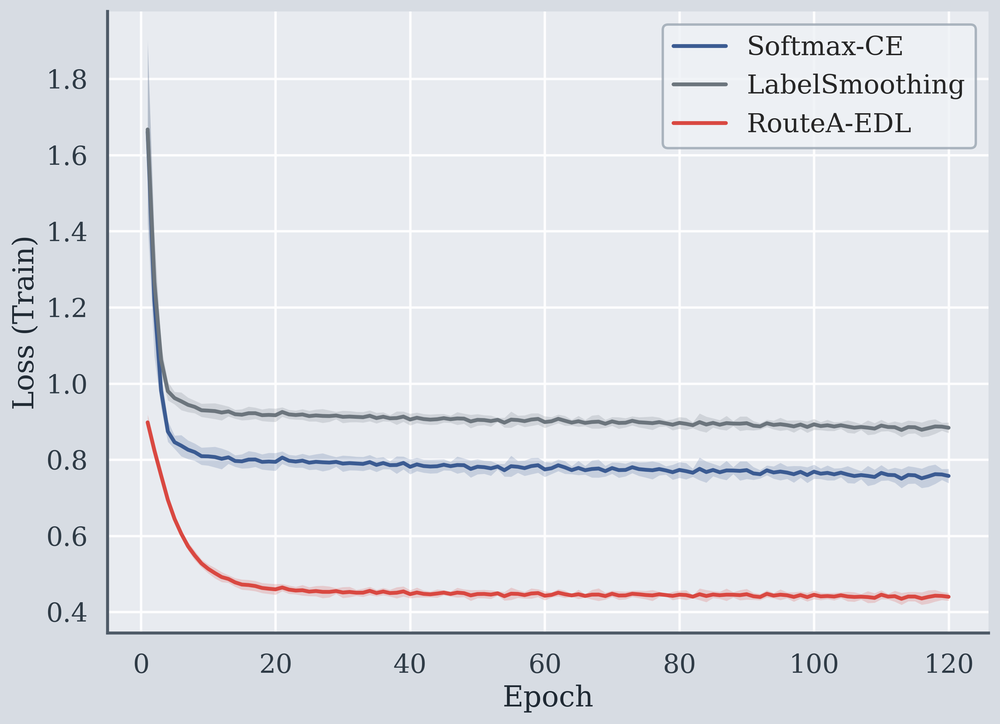

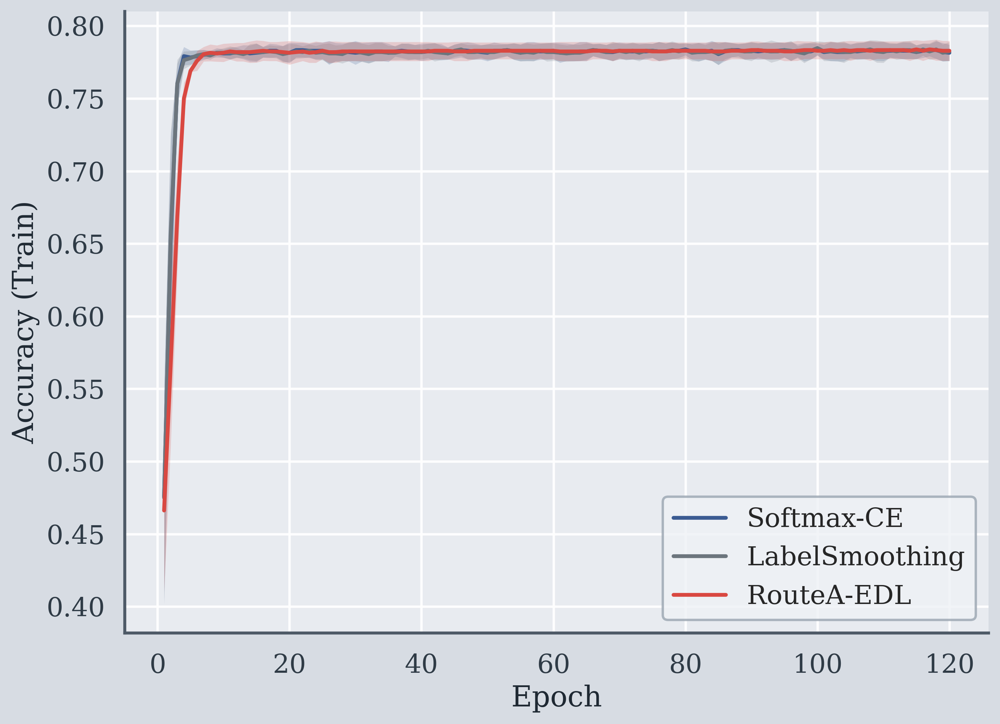

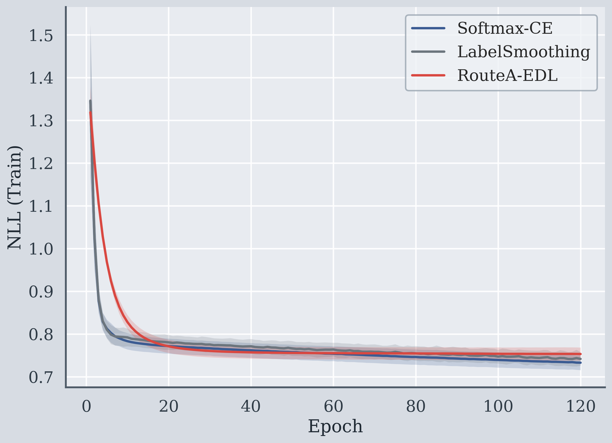

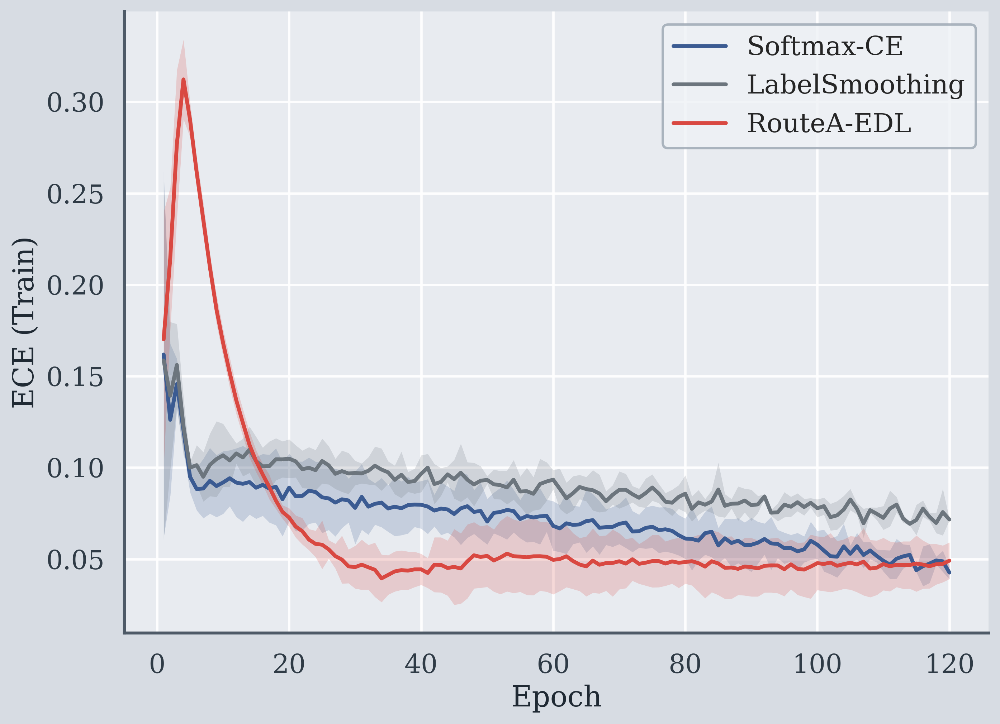

### 10.2 验证曲线（Validation）

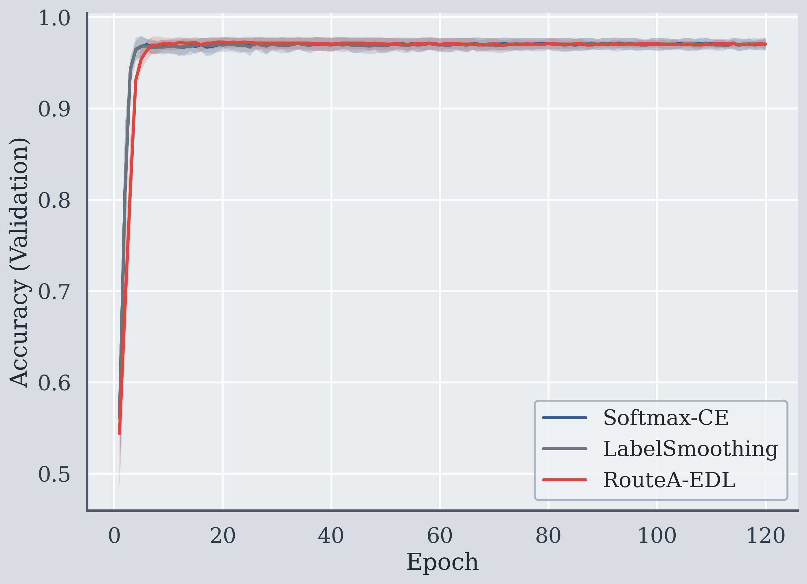

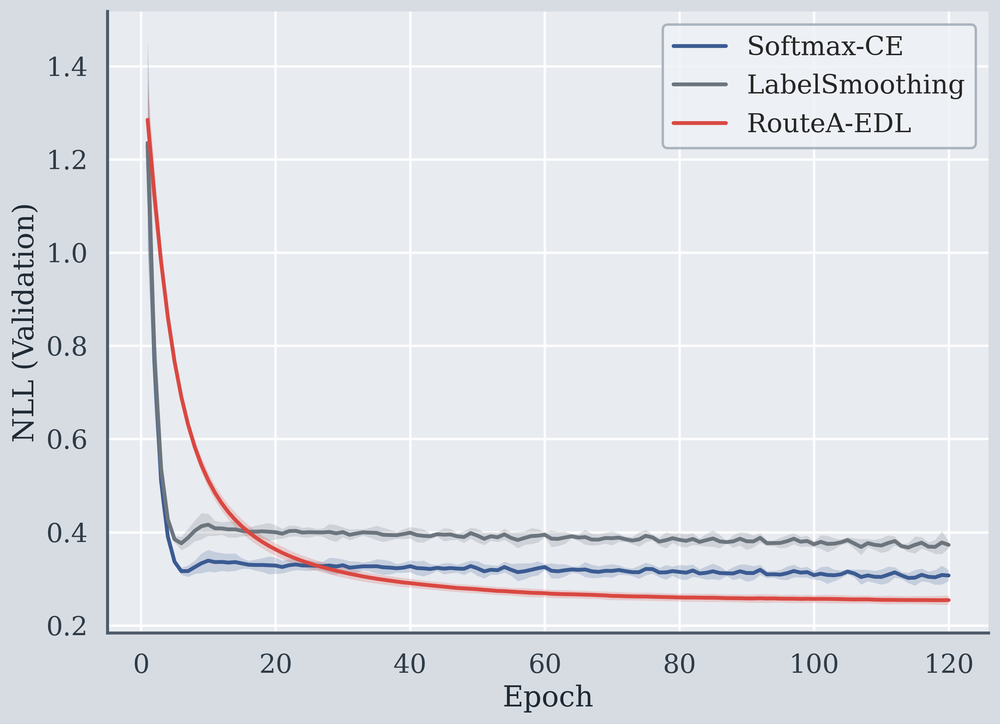

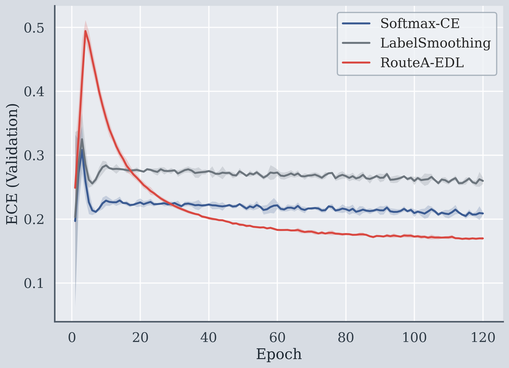

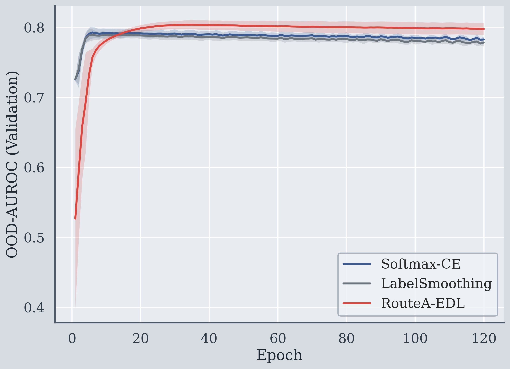

### 10.3 最终指标柱状图

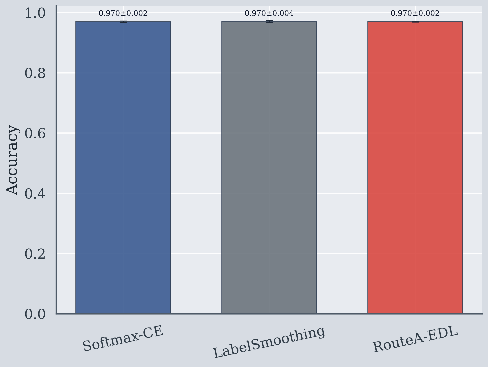

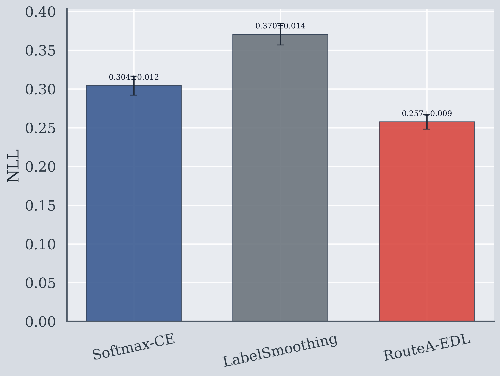


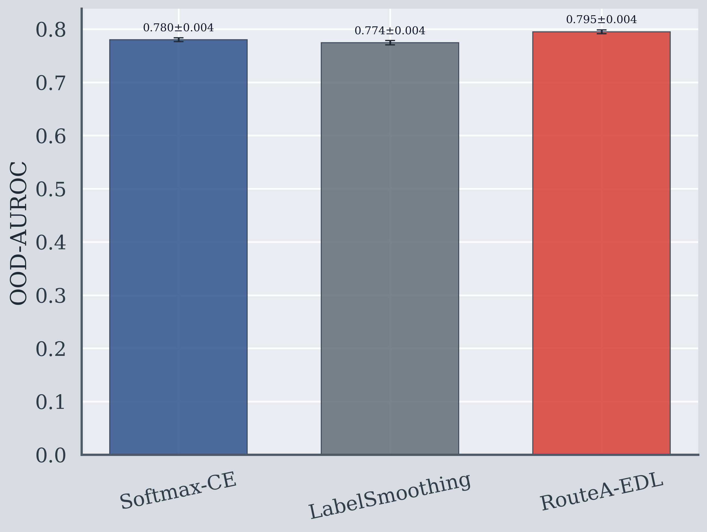
